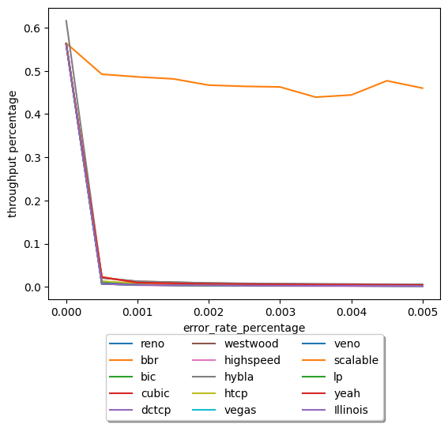

## congestion control ##

**Лучший алгоритм - BBR**

Исторические системы регулирования заторов TCP потерю пакетов интерпретируют
как «затор». С развитием технологий и увеличением пропускной способности каналов
и размеров буфферов связь между потерей пакетов и заторами стала менее очевидной.

Важныи отличием BBR является тот факт, что влияние потерь на его оценку пропускной 
способности является конфигурируемой величиной, в то время как в большинстве остальных
алгоритмов архитектурно заложено требование, что уровень потерь меньше, чем обратный 
квадрат bandwidth-delay для достижения полной пропускной способности.

