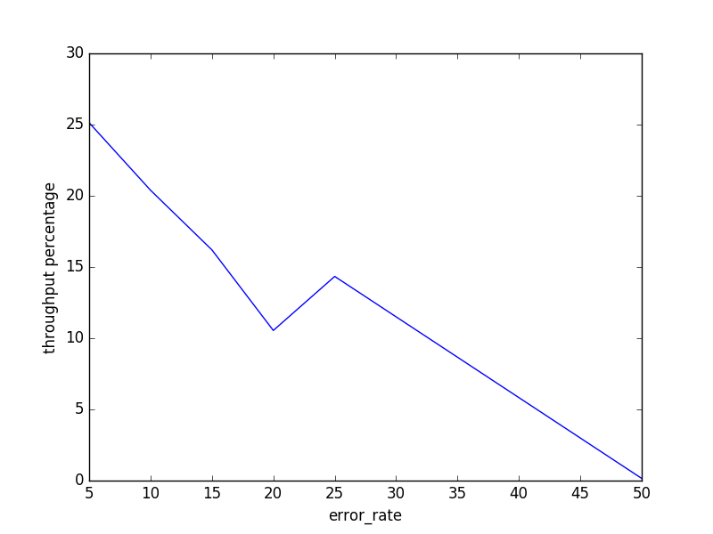

## congestion control ##

**Лучший алгоритм - BBR**

Причина - BBR не использует потерю пакетов как индикатор затора, 
в отличие от многих других алгоритмов.

### NOTES ###
1) Графики начинаются с `error_rate = 5`, так как иначе 
на графиках не видно процент для остальных алгоритмов, кроме BBR.